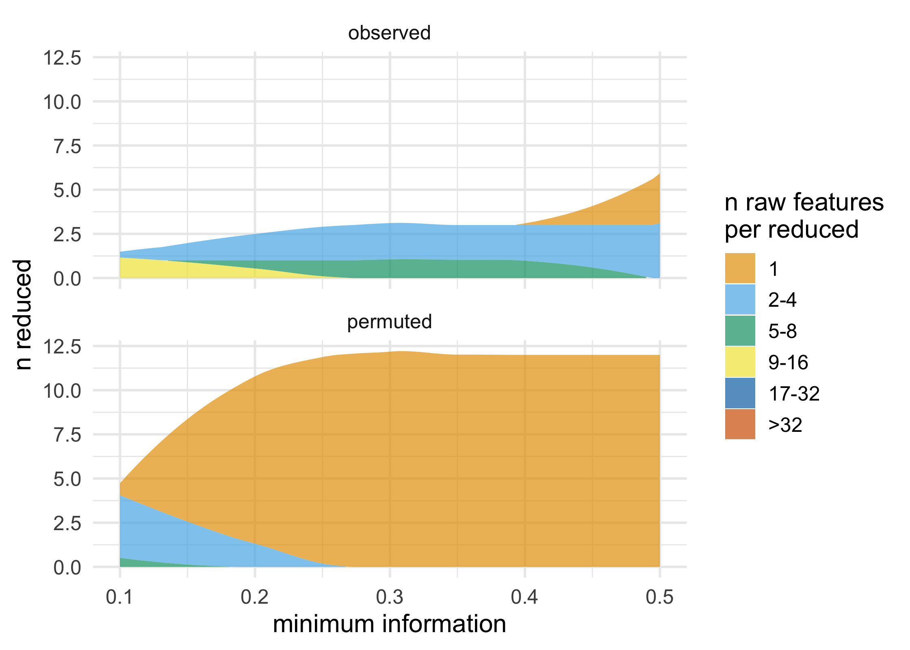
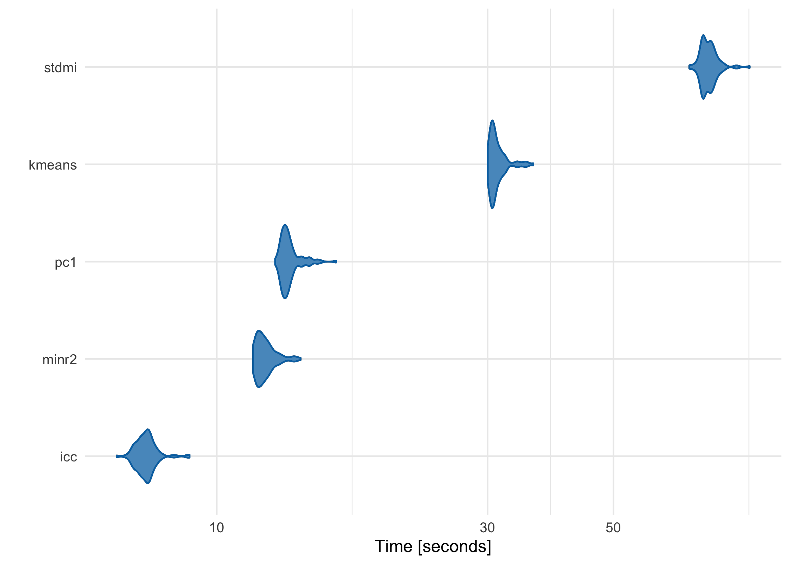
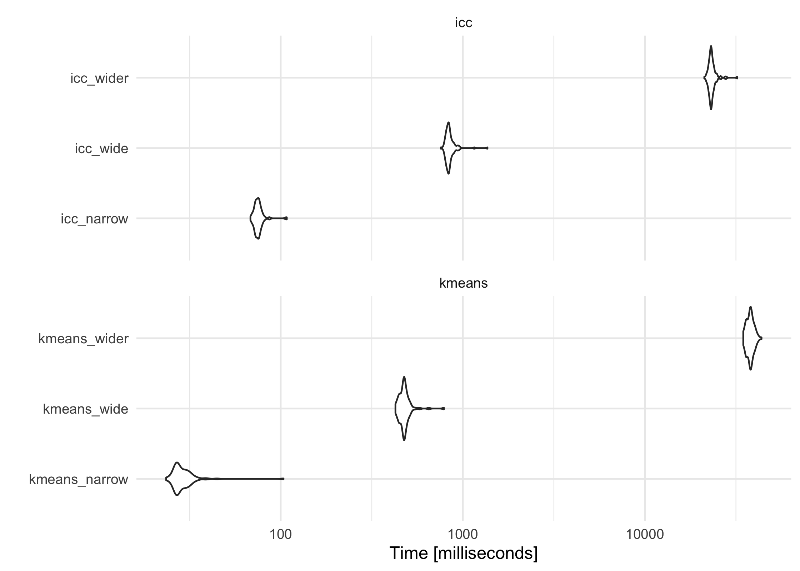

<!-- README.md is generated from README.Rmd. Please edit that file -->

<!-- badges: start -->

[](https://travis-ci.org/USCbiostats/partition)
[](https://ci.appveyor.com/project/malcolmbarrett/partition-qaqc6)
[](https://codecov.io/github/USCbiostats/partition?branch=master)
[](https://cran.r-project.org/package=partition)
[](https://doi.org/10.21105/joss.01991)
[](https://zenodo.org/badge/latestdoi/178615892)
<!-- badges: end -->

# partition

partition is a fast and flexible framework for agglomerative
partitioning. partition uses an approach called Direct-Measure-Reduce to
create new variables that maintain the user-specified minimum level of
information. Each reduced variable is also interpretable: the original
variables map to one and only one variable in the reduced data set.
partition is flexible, as well: how variables are selected to reduce,
how information loss is measured, and the way data is reduced can all be
customized.

## Installation

You can install the partition from CRAN with:

``` r
install.packages("partition")
```

Or you can install the development version of partition GitHub with:

``` r
# install.packages("remotes")
remotes::install_github("USCbiostats/partition")
```

## Example

``` r
library(partition)
set.seed(1234)
df <- simulate_block_data(c(3, 4, 5), lower_corr = .4, upper_corr = .6, n = 100)
#> New names:
#> * X1 -> X1...1
#> * X2 -> X2...2
#> * X3 -> X3...3
#> * X1 -> X1...4
#> * X2 -> X2...5
#> * ...

#  don't accept reductions where information < .6
prt <- partition(df, threshold = .6)
prt
#> Partitioner:
#>    Director: Minimum Distance (Pearson) 
#>    Metric: Intraclass Correlation 
#>    Reducer: Scaled Mean
#> 
#> Reduced Variables:
#> 1 reduced variables created from 2 observed variables
#> 
#> Mappings:
#> reduced_var_1 = {block2_x3, block2_x4}
#> 
#> Minimum information:
#> 0.602

# return reduced data
partition_scores(prt)
#> # A tibble: 100 x 11
#>    block1_x1 block1_x2 block1_x3 block2_x1 block2_x2 block3_x1 block3_x2
#>        <dbl>     <dbl>     <dbl>     <dbl>     <dbl>     <dbl>     <dbl>
#>  1   -1.00     -0.344      1.35     -0.526    -1.25      1.13     0.357 
#>  2    0.518    -0.434     -0.361    -1.48     -1.53     -0.317    0.290 
#>  3   -1.77     -0.913     -0.722     0.122     0.224    -0.529    0.114 
#>  4   -1.49     -0.998      0.189     0.149    -0.994    -0.433    0.0120
#>  5    0.616     0.0211     0.895     1.09     -1.25      0.440   -0.550 
#>  6    0.0765    0.522      1.20     -0.152    -0.419    -0.912   -0.362 
#>  7    1.74      0.0993    -0.654    -1.26     -0.502    -0.792   -1.03  
#>  8    1.05      2.19       0.913     0.254     0.328    -1.07    -0.976 
#>  9   -1.07     -0.292     -0.763     0.437     0.739     0.899   -0.342 
#> 10   -1.02     -0.959     -1.33     -1.57     -1.11      0.618    0.153 
#> # … with 90 more rows, and 4 more variables: block3_x3 <dbl>, block3_x4 <dbl>,
#> #   block3_x5 <dbl>, reduced_var_1 <dbl>

# access mapping keys
mapping_key(prt)
#> # A tibble: 11 x 4
#>    variable      mapping   information indices  
#>    <chr>         <list>          <dbl> <list>   
#>  1 block1_x1     <chr [1]>       1     <int [1]>
#>  2 block1_x2     <chr [1]>       1     <int [1]>
#>  3 block1_x3     <chr [1]>       1     <int [1]>
#>  4 block2_x1     <chr [1]>       1     <int [1]>
#>  5 block2_x2     <chr [1]>       1     <int [1]>
#>  6 block3_x1     <chr [1]>       1     <int [1]>
#>  7 block3_x2     <chr [1]>       1     <int [1]>
#>  8 block3_x3     <chr [1]>       1     <int [1]>
#>  9 block3_x4     <chr [1]>       1     <int [1]>
#> 10 block3_x5     <chr [1]>       1     <int [1]>
#> 11 reduced_var_1 <chr [2]>       0.602 <int [2]>

unnest_mappings(prt)
#> # A tibble: 12 x 4
#>    variable      mapping   information indices
#>    <chr>         <chr>           <dbl>   <int>
#>  1 block1_x1     block1_x1       1           1
#>  2 block1_x2     block1_x2       1           2
#>  3 block1_x3     block1_x3       1           3
#>  4 block2_x1     block2_x1       1           4
#>  5 block2_x2     block2_x2       1           5
#>  6 block3_x1     block3_x1       1           8
#>  7 block3_x2     block3_x2       1           9
#>  8 block3_x3     block3_x3       1          10
#>  9 block3_x4     block3_x4       1          11
#> 10 block3_x5     block3_x5       1          12
#> 11 reduced_var_1 block2_x3       0.602       6
#> 12 reduced_var_1 block2_x4       0.602       7

# use a lower threshold of information loss
partition(df, threshold = .5, partitioner = part_kmeans())
#> New names:
#> * NA -> ...1
#> * NA -> ...2
#> * NA -> ...3
#> * NA -> ...4
#> * NA -> ...5
#> * ...
#> Partitioner:
#>    Director: K-Means Clusters 
#>    Metric: Minimum Intraclass Correlation 
#>    Reducer: Scaled Mean
#> 
#> Reduced Variables:
#> 2 reduced variables created from 7 observed variables
#> 
#> Mappings:
#> reduced_var_1 = {block3_x1, block3_x2, block3_x5}
#> reduced_var_2 = {block2_x1, block2_x2, block2_x3, block2_x4}
#> 
#> Minimum information:
#> 0.508

# use a custom partitioner
part_icc_rowmeans <- replace_partitioner(
  part_icc, 
  reduce = as_reducer(rowMeans)
)
partition(df, threshold = .6, partitioner = part_icc_rowmeans) 
#> Partitioner:
#>    Director: Minimum Distance (Pearson) 
#>    Metric: Intraclass Correlation 
#>    Reducer: <custom reducer>
#> 
#> Reduced Variables:
#> 1 reduced variables created from 2 observed variables
#> 
#> Mappings:
#> reduced_var_1 = {block2_x3, block2_x4}
#> 
#> Minimum information:
#> 0.602
```

partition also supports a number of ways to visualize partitions and
permutation tests; these functions all start with `plot_*()`. These
functions all return ggplots and can thus be extended using ggplot2.

``` r
plot_stacked_area_clusters(df) +
  ggplot2::theme_minimal(14)
```



## Performance

partition has been meticulously benchmarked and profiled to improve
performance, and key sections are written in C++ or use C++-based
packages. Using a data frame with 1 million rows on a 2017 MacBook Pro
with 16 GB RAM, here’s how each of the built-in partitioners perform:

``` r
large_df <- simulate_block_data(c(3, 4, 5), lower_corr = .4, upper_corr = .6, n = 1e6)

basic_benchmarks <- microbenchmark::microbenchmark(
  icc = partition(large_df, .3),
  kmeans = partition(large_df, .3, partitioner = part_kmeans()),
  minr2 = partition(large_df, .3, partitioner = part_minr2()),
  pc1 = partition(large_df, .3, partitioner = part_pc1()),
  stdmi = partition(large_df, .3, partitioner = part_stdmi())
)
```



## ICC vs K-Means

As the features (columns) in the data set become greater than the number
of observations (rows), the default ICC method scales more linearly than
K-Means-based methods. While K-Means is often faster at lower
dimensions, it becomes slower as the features outnumber the
observations. For example, using three data sets with increasing numbers
of columns, K-Means starts as the fastest and gets increasingly slower,
although in this case it is still comparable to ICC:

``` r
narrow_df <- simulate_block_data(3:5, lower_corr = .4, upper_corr = .6, n = 100)
wide_df <- simulate_block_data(rep(3:10, 2), lower_corr = .4, upper_corr = .6, n = 100)
wider_df <- simulate_block_data(rep(3:20, 4), lower_corr = .4, upper_corr = .6, n = 100)

icc_kmeans_benchmarks <- microbenchmark::microbenchmark(
  icc_narrow = partition(narrow_df, .3),
  icc_wide = partition(wide_df, .3),
  icc_wider = partition(wider_df, .3),
  kmeans_narrow = partition(narrow_df, .3, partitioner = part_kmeans()),
  kmeans_wide = partition(wide_df, .3, partitioner = part_kmeans()),
  kmeans_wider  = partition(wider_df, .3, partitioner = part_kmeans())
)
```



For more information, see [our paper in
Bioinformatics](https://doi.org/10.1093/bioinformatics/btz661), which
discusses these issues in more depth (Millstein et al. 2020).

## Contributing

Please read the [Contributor
Guidelines](https://github.com/USCbiostats/partition/blob/master/.github/CONTRIBUTING.md)
prior to submitting a pull request to partition. Also note that this
project is released with a [Contributor Code of
Conduct](https://github.com/USCbiostats/partition/blob/master/.github/CODE_OF_CONDUCT.md).
By participating in this project you agree to abide by its terms.

## References

<div id="refs" class="references hanging-indent">

<div id="ref-R-partition">

Millstein, Joshua, Francesca Battaglin, Malcolm Barrett, Shu Cao, Wu
Zhang, Sebastian Stintzing, Volker Heinemann, and Heinz-Josef Lenz.
2020. “Partition: A Surjective Mapping Approach for Dimensionality
Reduction.” *Bioinformatics* 36 (3): 676–81.
<https://doi.org/10.1093/bioinformatics/btz661>.

</div>

</div>
