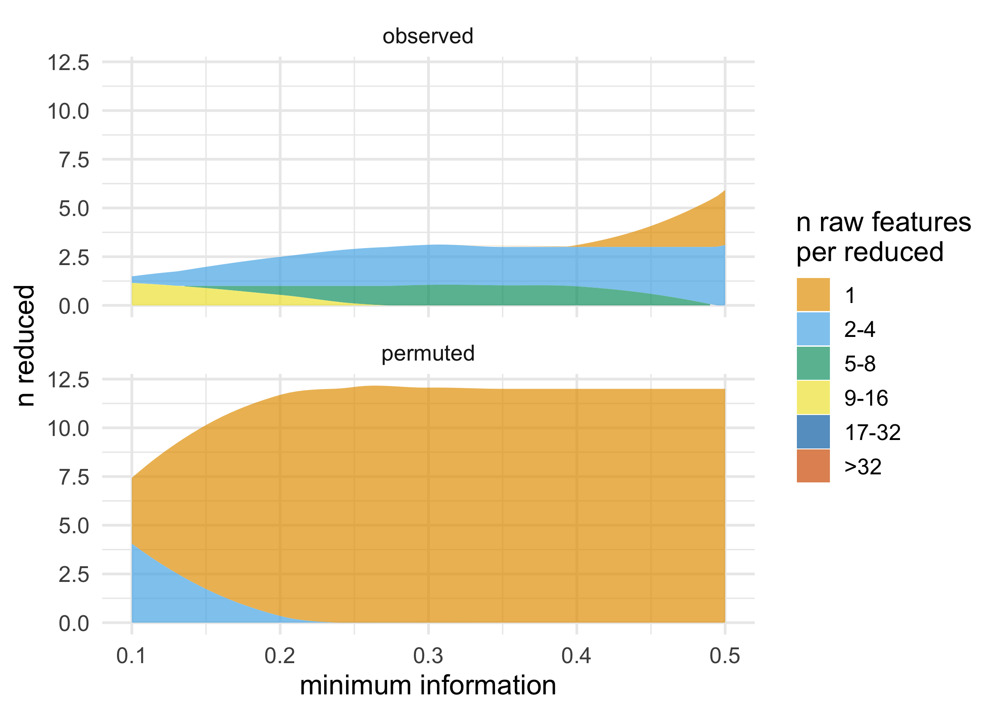

<!-- README.md is generated from README.Rmd. Please edit that file -->

[](https://travis-ci.org/malcolmbarrett/partition2)
[](https://ci.appveyor.com/project/malcolmbarrett/partition2)
[](https://codecov.io/github/malcolmbarrett/partition2?branch=master)

# partition2

partition2 is a fast and flexible framework for agglomerative
partitioning. partition uses an approach called Direct-Measure-Reduce to
create new variables that maintain the user-specified minimum level of
information. Each reduced variable is also interpretable: the original
variables map to one and only one variable in the reduced data set.
partition is flexible, as well: how variables are selected to reduce,
how information loss is measured, and the way data is reduced can all be
customized.

## Installation

You can install the development version of partition2 GitHub with:

``` r
# install.packages("remotes)
remotes::install_github("malcolmbarrett/partition2")
```

## Example

``` r
library(partition2)
df <- simulate_block_data(c(3, 4, 5), lower_corr = .4, upper_corr = .6, n = 100)

#  don't accept reductions where information < .6
prt <- partition(df, threshold = .6)
prt
#> Partitioner:
#>    Director: Minimum Distance (Pearson) 
#>    Metric: Intraclass Correlation 
#>    Reducer: Scaled Mean
#> 
#> Reduced Variables:
#> 1 reduced variables created from 2 observed variables
#> 
#> Mappings:
#> reduced_var_1 = {block3_x2, block3_x3}
#> 
#> Minimum information:
#> 0.619

# return reduced data
partition_scores(prt)
#> # A tibble: 100 x 11
#>    block1_x1 block1_x2 block1_x3 block2_x1 block2_x2 block2_x3 block2_x4
#>        <dbl>     <dbl>     <dbl>     <dbl>     <dbl>     <dbl>     <dbl>
#>  1    -1.30     -0.349   -0.404     0.258     -1.95     -0.239    0.420 
#>  2     1.60      0.687    0.856    -0.102     -0.729    -0.466   -0.119 
#>  3     0.282     1.19    -0.0147   -0.749      0.424     0.364   -0.0723
#>  4    -1.59      0.238   -0.334     0.812      1.22      0.417    1.59  
#>  5    -0.562     0.258   -2.58     -0.695     -0.600    -1.25     0.0531
#>  6    -1.19     -1.48    -1.40     -0.232      0.842    -0.232    0.815 
#>  7     0.748    -0.130    2.82     -0.161      0.779     0.127   -0.118 
#>  8     0.306     0.303    0.713     1.26      -0.346    -1.02    -0.151 
#>  9    -0.351    -0.203   -1.74     -1.35       1.08      1.42     0.884 
#> 10    -2.40     -0.243    0.428    -0.0632    -0.106     0.916    0.265 
#> # … with 90 more rows, and 4 more variables: block3_x1 <dbl>,
#> #   block3_x4 <dbl>, block3_x5 <dbl>, reduced_var_1 <dbl>

# access mapping keys
mapping_key(prt)
#> # A tibble: 11 x 4
#>    variable      mapping   information indices  
#>    <chr>         <list>          <dbl> <list>   
#>  1 block1_x1     <chr [1]>       1     <int [1]>
#>  2 block1_x2     <chr [1]>       1     <int [1]>
#>  3 block1_x3     <chr [1]>       1     <int [1]>
#>  4 block2_x1     <chr [1]>       1     <int [1]>
#>  5 block2_x2     <chr [1]>       1     <int [1]>
#>  6 block2_x3     <chr [1]>       1     <int [1]>
#>  7 block2_x4     <chr [1]>       1     <int [1]>
#>  8 block3_x1     <chr [1]>       1     <int [1]>
#>  9 block3_x4     <chr [1]>       1     <int [1]>
#> 10 block3_x5     <chr [1]>       1     <int [1]>
#> 11 reduced_var_1 <chr [2]>       0.619 <int [2]>

unnest_mappings(prt)
#> # A tibble: 12 x 4
#>    variable      information mapping   indices
#>    <chr>               <dbl> <chr>       <int>
#>  1 block1_x1           1     block1_x1       1
#>  2 block1_x2           1     block1_x2       2
#>  3 block1_x3           1     block1_x3       3
#>  4 block2_x1           1     block2_x1       4
#>  5 block2_x2           1     block2_x2       5
#>  6 block2_x3           1     block2_x3       6
#>  7 block2_x4           1     block2_x4       7
#>  8 block3_x1           1     block3_x1       8
#>  9 block3_x4           1     block3_x4      11
#> 10 block3_x5           1     block3_x5      12
#> 11 reduced_var_1       0.619 block3_x2       9
#> 12 reduced_var_1       0.619 block3_x3      10

# use a lower threshold of information loss
partition(df, threshold = .5, partitioner = part_kmeans())
#> Partitioner:
#>    Director: K-Means Clusters 
#>    Metric: Minimum Intraclass Correlation 
#>    Reducer: Scaled Mean
#> 
#> Reduced Variables:
#> 1 reduced variables created from 2 observed variables
#> 
#> Mappings:
#> reduced_var_1 = {block2_x3, block2_x4}
#> 
#> Minimum information:
#> 0.543

# use a custom partitioner
part_icc_rowmeans <- replace_partitioner(
  part_icc, 
  reduce = as_reducer(rowMeans)
)
partition(df, threshold = .6, partitioner = part_icc_rowmeans) 
#> Partitioner:
#>    Director: Minimum Distance (Pearson) 
#>    Metric: Intraclass Correlation 
#>    Reducer: <custom reducer>
#> 
#> Reduced Variables:
#> 1 reduced variables created from 2 observed variables
#> 
#> Mappings:
#> reduced_var_1 = {block3_x2, block3_x3}
#> 
#> Minimum information:
#> 0.619
```

partition also supports a number of ways to visualize partitions and
permutation tests; these functions all start with `plot_*()`. These
functions all return ggplots and can thus be extended using ggplot2.

``` r
plot_stacked_area_clusters(df) +
  ggplot2::theme_minimal(14)
```


